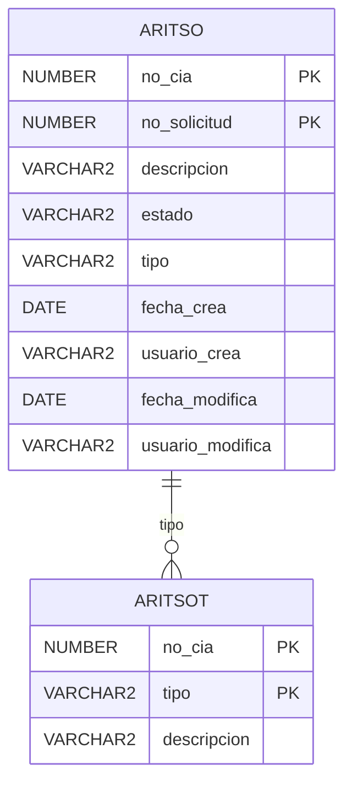

# Esquema de Base de Datos — [Nombre del Proyecto]

> **INSTRUCCIÓN:** Reemplazá este archivo con tu esquema Mermaid real.
> El agente leerá este archivo para identificar entidades, atributos y relaciones
> antes de generar cualquier script DDL.

## Esquema Entidad-Relación

## Notas del esquema

- Owner del esquema: `[it53 / fa01 / etc.]`
- Módulo: `[IT / FA / IN / etc.]`
- Descripción del proyecto: [descripción breve]
